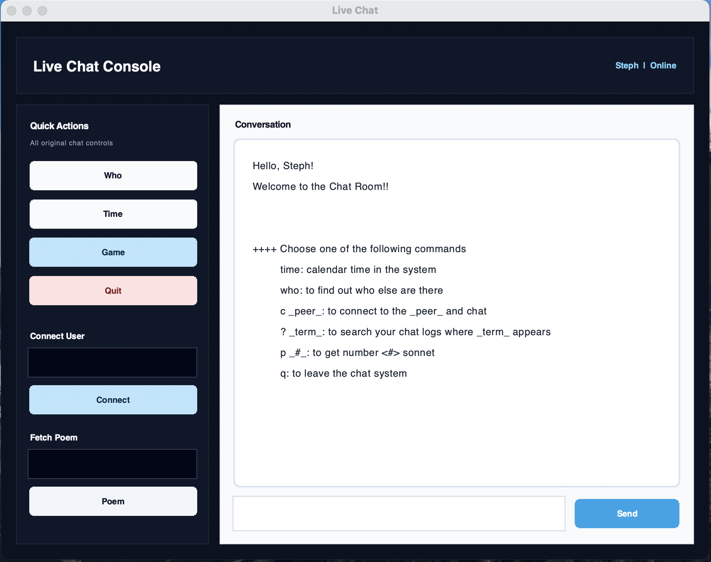
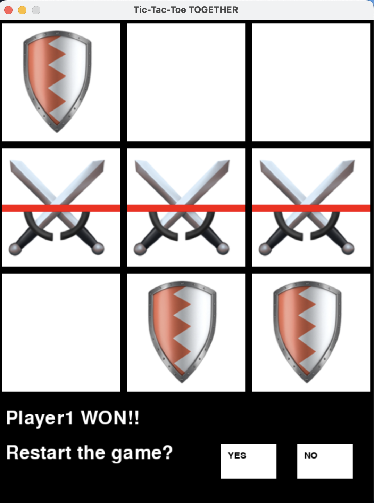

# python-socket-chatroom
A socket-based client–server chatroom system in Python with GUI interface, chat indexing, and integrated mini games.
# Demo
### Login
<p align="center">

</p>

### Chat room
<p align="center">

</p>

### Game
<p align="center">

</p>

# Features
- Multi-user chat system using sockets
- Login & registration system
- GUI interface
- Peer-to-peer chat groups
- Chat history search
- Shakespeare sonnet retrieval
- Built-in Tic-Tac-Toe game

# How to run
In seperate terminals:
- Start the server
```bash
python chat_server.py
```
- Run the client
```bash
python chat_cmdl_client.py
```


